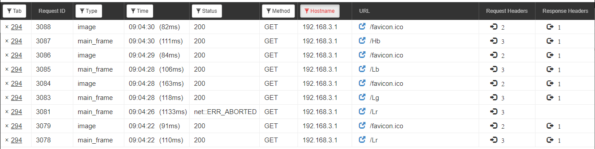

# Arduino Portenta H7
*Tinkering with the Arduino Portenta H7.*


## Blink with dual M7-M4 cores
> `LL_RCC_ForceCM4Boot()` must be called in M7 sketch to start M4 sketch

```cpp
/* BlinkGreenM7.ino
   MIT License (c) Faure Systems <dev at faure dot systems>

   LL_RCC_ForceCM4Boot() must be called in M7 sketch to start M4 sketch

   Ref: https://www.arduino.cc/pro/tutorials/portenta-h7/por-ard-dcp
*/

// the setup function runs once when you press reset or power the board
void setup() {
  LL_RCC_ForceCM4Boot();
  // initialize digital pin LEDR as an output.
  pinMode(LEDG, OUTPUT);
}

// the loop function runs over and over again forever
void loop() {
  digitalWrite(LEDG, LOW); // turn the red LED on (LOW is the voltage level)
  delay(450); // wait for 200 milliseconds
  digitalWrite(LEDG, HIGH); // turn the LED off by making the voltage HIGH
  delay(450); // wait for 200 milliseconds
}
```

```cpp
/* BlinkBlueM4.ino
   MIT License (c) Faure Systems <dev at faure dot systems>
*/

// the setup function runs once when you press reset or power the board
void setup() {
    // initialize digital pin LEDR as an output.
    pinMode(LEDB, OUTPUT);
}

// the loop function runs over and over again forever
void loop() {
   digitalWrite(LEDB, LOW); // turn the red LED on (LOW is the voltage level)
   delay(200); // wait for 200 milliseconds
   digitalWrite(LEDB, HIGH); // turn the LED off by making the voltage HIGH
   delay(200); // wait for 200 milliseconds
}
```


## Simple web server on M7
Upload a stop sktech to M4: <a href="blink-webserver/StopM4/StopM4.ino" target="_blank">StopM4.ino</a>

Change `arduino-secrets.h`:
```cpp
# define SECRET_SSID "PortentaAccessPoint"
# define SECRET_PASS "123Qwerty"
```

Upload web server on M7: <a href="blink-webserver/SimpleWebServerM7/SimpleWebServerM7.ino" target="_blank">SimpleWebServerM7.ino</a>

Start Arduino IDE monitor, then connect your computer to the `PortentaAccessPoint` WiFi network and open you browser for `http://192.168.3.1`


You can look at the HTTP traffic in Chrome sniffer:


## Links
Portenta H7 board:
* <a href="https://www.arduino.cc/pro/tutorials/portenta-h7/por-ard-gs" target="_blank">Setting Up Portenta H7 For Arduino</a>
* <a href="https://blog.st.com/portenta-h7/" target="_blank">Portenta H7, the First STM32 Arduino Board to Conquer Industrial Applications</a>
* Issues:
    - <a href="https://github.com/arduino/arduino-cli/issues/771" target="_blank">Portenta H7 (arduino-beta:mbed) - Hyphens in FQBN not supported? #771</a>
    - <a href="https://forum.arduino.cc/index.php?topic=691052.0" target="_blank">Portenta H7 Linux - not working (Solved)</a>

Arm Mbed OS:
* <a href="https://os.mbed.com/docs/mbed-os/v5.15/apis/index.html" target="_blank">Full API list</a>


## MQTT on M7 WiFi client

 Working on it


## Author

**Jean-Michel _(Jim)_ FAURE** (July 9th, 2020)
* company: FAURE SYSTEMS®
* mail: *dev at faure dot systems*
* github: <a href="https://github.com/fauresystems" target="_blank">fauresystems</a>
* web: <a href="https://faure.systems/" target="_blank">Faure●Systems</a>